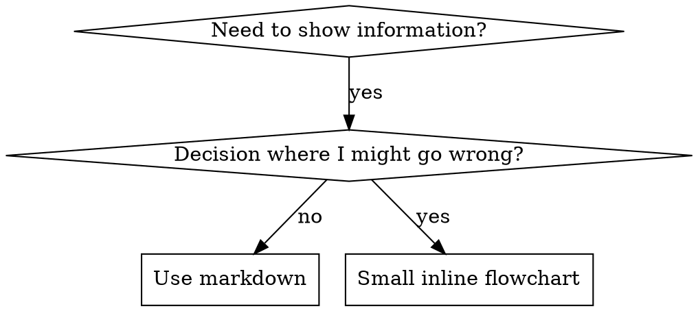

# Writing Skills

## Overview

### Writing skills IS Test-Driven Development applied to process documentation

#### Personal skills live in agent-specific directories (`~/.claude/skills` for Claude Code, `~/.agents/skills/` for Codex, `C:\Users\agaur\.gemini\antigravity\skills` for Antigravity)

You write test cases (pressure scenarios with subagents), watch them fail (baseline behavior), write the skill (documentation), watch tests pass (agents comply), and refactor (close loopholes).

**Core principle:** If you didn't watch an agent fail without the skill, you don't know if the skill teaches the right thing.

**REQUIRED BACKGROUND:** You MUST understand mega-skills:test-driven-development before using this skill. That skill defines the fundamental RED-GREEN-REFACTOR cycle. This skill adapts TDD to documentation.

**Official guidance:** For Anthropic's official skill authoring best practices, see anthropic-best-practices.md. This document provides additional patterns and guidelines that complement the TDD-focused approach in this skill.

## What is a Skill

A **skill** is a reference guide for proven techniques, patterns, or tools. Skills help future Claude instances find and apply effective approaches.

**Skills are:** Reusable techniques, patterns, tools, reference guides

**Skills are NOT:** Narratives about how you solved a problem once

## TDD Mapping for Skills

| TDD Concept | Skill Creation |
|:::::::::::::::::::::::::::::::::::::::::::::::::::::::::::::::::::::::::::::::::::::::::::::::::::::::::::::::::::::::::::::::::::::::::::::::::::::::::::::::::::::::::::::::::::::::::::::::::::::::::::::::::::::::---:::::::::::::::::::::::::::::::::::::::::::::::::::::::::::::::::::::::::::::::::::::::::::::::::::::::::::::::::::::::::::::::::::::::::::::::::::::::::::::::::::::::::::::::::::::::::::::::::::::::::::::::::::::::---:::::::::::::::::::::::::::::::::::::::::::::::::::::::::::::::::::::::::::::::::::::::::::::::::::::::::::::::::::::::::::::::::::::::::::::::::::::::::::::::::::::::::::::::::::::::::::::::::::::::::::::::::::::::---:::::::::::::::::::::::::::::::::::::::::::::::::::::::::::::::::::::::::::::::::::::::::::::::::::::::::::::::::::::::::::::::::::::::::::::::::::::::::::::::::::::::::::::::::::::::::::::::::::::::::::::::::::::::----|:::::::::::::::::::::::::::::::::::::::::::::::::::::::::::::::::::::::::::::::::::::::::::::::::::::::::::::::::::::::::::::::::::::::::::::::::::::::::::::::::::::::::::::::::::::::::::::::::::::::::::::::::::::::---:::::::::::::::::::::::::::::::::::::::::::::::::::::::::::::::::::::::::::::::::::::::::::::::::::::::::::::::::::::::::::::::::::::::::::::::::::::::::::::::::::::::::::::::::::::::::::::::::::::::::::::::::::::::---:::::::::::::::::::::::::::::::::::::::::::::::::::::::::::::::::::::::::::::::::::::::::::::::::::::::::::::::::::::::::::::::::::::::::::::::::::::::::::::::::::::::::::::::::::::::::::::::::::::::::::::::::::::::---:::::::::::::::::::::::::::::::::::::::::::::::::::::::::::::::::::::::::::::::::::::::::::::::::::::::::::::::::::::::::::::::::::::::::::::::::::::::::::::::::::::::::::::::::::::::::::::::::::::::::::::::::::::::---:::::::::::::::::::::::::::::::::::::::::::::::::::::::::::::::::::::::::::::::::::::::::::::::::::::::::::::::::::::::::::::::::::::::::::::::::::::::::::::::::::::::::::::::::::::::::::::::::::::::::::::::::::::::----|
| **Test case** | Pressure scenario with subagent |
| **Production code** | Skill document (SKILL.md) |
| **Test fails (RED)** | Agent violates rule without skill (baseline) |
| **Test passes (GREEN)** | Agent complies with skill present |
| **Refactor** | Close loopholes while maintaining compliance |
| **Write test first** | Run baseline scenario BEFORE writing skill |
| **Watch it fail** | Document exact rationalizations agent uses |
| **Minimal code** | Write skill addressing those specific violations |
| **Watch it pass** | Verify agent now complies |
| **Refactor cycle** | Find new rationalizations → plug → re-verify |

The entire skill creation process follows RED-GREEN-REFACTOR.

## When to Create a Skill

### Create when

1. Technique wasn't intuitively obvious to you

1. You'd reference this again across projects

1. Pattern applies broadly (not project-specific)

1. Others would benefit

#### Don't create for

1. One-off solutions

1. Standard practices well-documented elsewhere

1. Project-specific conventions (put in CLAUDE.md)

1. Mechanical constraints (if it's enforceable with regex/validation, automate it—save documentation for judgment calls)

## Skill Types

### Technique

Concrete method with steps to follow (condition-based-waiting, root-cause-tracing)

### Pattern

Way of thinking about problems (flatten-with-flags, test-invariants)

### Reference

API docs, syntax guides, tool documentation (office docs)

## Directory Structure

```text
skills/
  skill-name/
    SKILL.md              # Main reference (required)
    supporting-file.*     # Only if needed
```

**Flat namespace** - all skills in one searchable namespace

### Separate files for

1. **Heavy reference** (100+ lines) - API docs, comprehensive syntax

1. **Reusable tools** - Scripts, utilities, templates

#### Keep inline

1. Principles and concepts

1. Code patterns (< 50 lines)

1. Everything else

## SKILL.md Structure

### Frontmatter (YAML)

1. Two required fields: `name` and `description` (see [agentskills.io/specification](https://a)gentskills.io/specification) for all supported fields)

1. Max 1024 characters total

1. `name`: Use letters, numbers, and hyphens only (no parentheses, special chars)

1. `description`: Third-person, describes ONLY when to use (NOT what it does)

1. Start with "Use when..." to focus on triggering conditions
1. Include specific symptoms, situations, and contexts
1. **NEVER summarize the skill's process or workflow** (see CSO section for why)
1. Keep under 500 characters if possible

```markdown
---
name: Skill-Name-With-Hyphens
description: Use when [specific triggering conditions and symptoms]
---
## Skill Name
## Overview (2)
What is this? Core principle in 1-2 sentences.
## When to Use
[Small inline flowchart IF decision non-obvious]
Bullet list with SYMPTOMS and use cases
When NOT to use
## Core Pattern (for techniques/patterns)
Before/after code comparison
## Quick Reference
Table or bullets for scanning common operations
## Implementation
Inline code for simple patterns
Link to file for heavy reference or reusable tools
## Common Mistakes
What goes wrong + fixes
## Real-World Impact (optional)
Concrete results
```

## Claude Search Optimization (CSO)

**Critical for discovery:** Future Claude needs to FIND your skill

### 1. Rich Description Field

**Purpose:** Claude reads description to decide which skills to load for a given task. Make it answer: "Should I read this skill right now?"

**Format:** Start with "Use when..." to focus on triggering conditions

#### CRITICAL: Description = When to Use, NOT What the Skill Does

The description should ONLY describe triggering conditions. Do NOT summarize the skill's process or workflow in the description.

**Why this matters:** Testing revealed that when a description summarizes the skill's workflow, Claude may follow the description instead of reading the full skill content. A description saying "code review between tasks" caused Claude to do ONE review, even though the skill's flowchart clearly showed TWO reviews (spec compliance then code quality).

When the description was changed to just "Use when executing implementation plans with independent tasks" (no workflow summary), Claude correctly read the flowchart and followed the two-stage review process.

**The trap:** Descriptions that summarize workflow create a shortcut Claude will take. The skill body becomes documentation Claude skips.

```yaml
## ❌ BAD: Summarizes workflow - Claude may follow this instead of reading skill
description: Use when executing plans - dispatches subagent per task with code review between tasks
## ❌ BAD: Too much process detail
description: Use for TDD - write test first, watch it fail, write minimal code, refactor
## ✅ GOOD: Just triggering conditions, no workflow summary
description: Use when executing implementation plans with independent tasks in the current session
## ✅ GOOD: Triggering conditions only
description: Use when implementing any feature or bugfix, before writing implementation code
```

### Content

1. Use concrete triggers, symptoms, and situations that signal this skill applies

1. Describe the *problem* (race conditions, inconsistent behavior) not *language-specific symptoms* (setTimeout, sleep)

1. Keep triggers technology-agnostic unless the skill itself is technology-specific

1. If skill is technology-specific, make that explicit in the trigger

1. Write in third person (injected into system prompt)

1. **NEVER summarize the skill's process or workflow**

```yaml
## ❌ BAD: Too abstract, vague, doesn't include when to use
description: For async testing
## ❌ BAD: First person
description: I can help you with async tests when they're flaky
## ❌ BAD: Mentions technology but skill isn't specific to it
description: Use when tests use setTimeout/sleep and are flaky
## ✅ GOOD: Starts with "Use when", describes problem, no workflow
description: Use when tests have race conditions, timing dependencies, or pass/fail inconsistently
## ✅ GOOD: Technology-specific skill with explicit trigger
description: Use when using React Router and handling authentication redirects
```

### 2. Keyword Coverage

Use words Claude would search for:

1. Error messages: "Hook timed out", "ENOTEMPTY", "race condition"

1. Symptoms: "flaky", "hanging", "zombie", "pollution"

1. Synonyms: "timeout/hang/freeze", "cleanup/teardown/afterEach"

1. Tools: Actual commands, library names, file types

### 3. Descriptive Naming

#### Use active voice, verb-first

1. ✅ `creating-skills` not `skill-creation`

1. ✅ `condition-based-waiting` not `async-test-helpers`

### 4. Token Efficiency (Critical)

**Problem:** getting-started and frequently-referenced skills load into EVERY conversation. Every token counts.

#### Target word counts

1. getting-started workflows: <150 words each

1. Frequently-loaded skills: <200 words total

1. Other skills: <500 words (still be concise)

#### Techniques

#### Move details to tool help

```bash
## ❌ BAD: Document all flags in SKILL.md
search-conversations supports --text, --both, --after DATE, --before DATE, --limit N
## ✅ GOOD: Reference --help
search-conversations supports multiple modes and filters. Run --help for details.
```

### Use cross-references

```markdown
## ❌ BAD: Repeat workflow details
When searching, dispatch subagent with template...
[20 lines of repeated instructions]
## ✅ GOOD: Reference other skill
Always use subagents (50-100x context savings). REQUIRED: Use [other-skill-name] for workflow.
```

### Compress examples

```markdown
## ❌ BAD: Verbose example (42 words)
your human partner: "How did we handle authentication errors in React Router before?"
You: I'll search past conversations for React Router authentication patterns.
[Dispatch subagent with search query: "React Router authentication error handling 401"]
## ✅ GOOD: Minimal example (20 words)
Partner: "How did we handle auth errors in React Router?"
You: Searching...
[Dispatch subagent → synthesis]
```

### Eliminate redundancy

1. Don't repeat what's in cross-referenced skills

1. Don't explain what's obvious from command

1. Don't include multiple examples of same pattern

#### Verification

```bash
wc -w skills/path/SKILL.md
## getting-started workflows: aim for <150 each
## Other frequently-loaded: aim for <200 total
```

### Name by what you DO or core insight

1. ✅ `condition-based-waiting` > `async-test-helpers`

1. ✅ `using-skills` not `skill-usage`

1. ✅ `flatten-with-flags` > `data-structure-refactoring`

1. ✅ `root-cause-tracing` > `debugging-techniques`

#### Gerunds (-ing) work well for processes

1. `creating-skills`, `testing-skills`, `debugging-with-logs`

1. Active, describes the action you're taking

### 4. Cross-Referencing Other Skills

#### When writing documentation that references other skills

Use skill name only, with explicit requirement markers:

1. ✅ Good: `**REQUIRED SUB-SKILL:** Use mega-skills:test-driven-development`

1. ✅ Good: `**REQUIRED BACKGROUND:** You MUST understand mega-skills:systematic-debugging`

1. ❌ Bad: `See skills/testing/test-driven-development` (unclear if required)

1. ❌ Bad: `@skills/testing/test-driven-development/SKILL.md` (force-loads, burns context)

**Why no @ links:** `@` syntax force-loads files immediately, consuming 200k+ context before you need them.

## Flowchart Usage



### Use flowcharts ONLY for

1. Non-obvious decision points

1. Process loops where you might stop too early

1. "When to use A vs B" decisions

#### Never use flowcharts for

1. Reference material → Tables, lists

1. Code examples → Markdown blocks

1. Linear instructions → Numbered lists

1. Labels without semantic meaning (step1, helper2)

See @graphviz-conventions.dot for graphviz style rules.

**Visualizing for your human partner:** Use `render-graphs.js` in this directory to render a skill's flowcharts to SVG:

```bash
./render-graphs.js ../some-skill           # Each diagram separately
./render-graphs.js ../some-skill --combine # All diagrams in one SVG
```

## Code Examples

### One excellent example beats many mediocre ones

Choose most relevant language:

1. Testing techniques → TypeScript/JavaScript

1. System debugging → Shell/Python

1. Data processing → Python

#### Good example

1. Complete and runnable

1. Well-commented explaining WHY

1. From real scenario

1. Shows pattern clearly

1. Ready to adapt (not generic template)

#### Don't

1. Implement in 5+ languages

1. Create fill-in-the-blank templates

1. Write contrived examples

You're good at porting - one great example is enough.

## File Organization

### Self-Contained Skill

```text
defense-in-depth/
  SKILL.md    # Everything inline
```

When: All content fits, no heavy reference needed

### Skill with Reusable Tool

```text
condition-based-waiting/
  SKILL.md    # Overview + patterns
  example.ts  # Working helpers to adapt
```

When: Tool is reusable code, not just narrative

### Skill with Heavy Reference

```text
pptx/
  SKILL.md       # Overview + workflows
  pptxgenjs.md   # 600 lines API reference
  ooxml.md       # 500 lines XML structure
  scripts/       # Executable tools
```

When: Reference material too large for inline

## The Iron Law (Same as TDD)

```text
NO SKILL WITHOUT A FAILING TEST FIRST
```

This applies to NEW skills AND EDITS to existing skills.

Write skill before testing? Delete it. Start over.
Edit skill without testing? Same violation.

### No exceptions

1. Not for "simple additions"

1. Not for "just adding a section"

1. Not for "documentation updates"

1. Don't keep untested changes as "reference"

1. Don't "adapt" while running tests

1. Delete means delete

**REQUIRED BACKGROUND:** The mega-skills:test-driven-development skill explains why this matters. Same principles apply to documentation.

## Testing All Skill Types

Different skill types need different test approaches:

### Discipline-Enforcing Skills (rules/requirements)

**Examples:** TDD, verification-before-completion, designing-before-coding

#### Test with

1. Academic questions: Do they understand the rules?

1. Pressure scenarios: Do they comply under stress?

1. Multiple pressures combined: time + sunk cost + exhaustion

1. Identify rationalizations and add explicit counters

**Success criteria:** Agent follows rule under maximum pressure

### Technique Skills (how-to guides)

**Examples:** condition-based-waiting, root-cause-tracing, defensive-programming

#### Test with (2)

1. Application scenarios: Can they apply the technique correctly?

1. Variation scenarios: Do they handle edge cases?

1. Missing information tests: Do instructions have gaps?

**Success criteria:** Agent successfully applies technique to new scenario

### Pattern Skills (mental models)

**Examples:** reducing-complexity, information-hiding concepts

#### Test with (3)

1. Recognition scenarios: Do they recognize when pattern applies?

1. Application scenarios: Can they use the mental model?

1. Counter-examples: Do they know when NOT to apply?

**Success criteria:** Agent correctly identifies when/how to apply pattern

### Reference Skills (documentation/APIs)

**Examples:** API documentation, command references, library guides

#### Test with (4)

1. Retrieval scenarios: Can they find the right information?

1. Application scenarios: Can they use what they found correctly?

1. Gap testing: Are common use cases covered?

**Success criteria:** Agent finds and correctly applies reference information

## Common Rationalizations for Skipping Testing

| Excuse | Reality |
|:::::::::::::::::::::::::::::::::::::::::::::::::::::::::::::::::::::::::::::::::::::::::::::::::::::::::::::::::::::::::::::::::::::::::::::::::::::::::::::::::::::::::::::::::::::::::::::::::::::::::::::::::::::::---:::::::::::::::::::::::::::::::::::::::::::::::::::::::::::::::::::::::::::::::::::::::::::::::::::::::::::::::::::::::::::::::::::::::::::::::::::::::::::::::::::::::::::::::::::::::::::::::::::::::::::::::::::::::-----|:::::::::::::::::::::::::::::::::::::::::::::::::::::::::::::::::::::::::::::::::::::::::::::::::::::::::::::::::::::::::::::::::::::::::::::::::::::::::::::::::::::::::::::::::::::::::::::::::::::::::::::::::::::::---:::::::::::::::::::::::::::::::::::::::::::::::::::::::::::::::::::::::::::::::::::::::::::::::::::::::::::::::::::::::::::::::::::::::::::::::::::::::::::::::::::::::::::::::::::::::::::::::::::::::::::::::::::::::---:::::::::::::::::::::::::::::::::::::::::::::::::::::::::::::::::::::::::::::::::::::::::::::::::::::::::::::::::::::::::::::::::::::::::::::::::::::::::::::::::::::::::::::::::::::::::::::::::::::::::::::::::::::::---|
| "Skill is obviously clear" | Clear to you ≠ clear to other agents. Test it. |
| "It's just a reference" | References can have gaps, unclear sections. Test retrieval. |
| "Testing is overkill" | Untested skills have issues. Always. 15 min testing saves hours. |
| "I'll test if problems emerge" | Problems = agents can't use skill. Test BEFORE deploying. |
| "Too tedious to test" | Testing is less tedious than debugging bad skill in production. |
| "I'm confident it's good" | Overconfidence guarantees issues. Test anyway. |
| "Academic review is enough" | Reading ≠ using. Test application scenarios. |
| "No time to test" | Deploying untested skill wastes more time fixing it later. |

### All of these mean: Test before deploying. No exceptions

## Bulletproofing Skills Against Rationalization

Skills that enforce discipline (like TDD) need to resist rationalization. Agents are smart and will find loopholes when under pressure.

**Psychology note:** Understanding WHY persuasion techniques work helps you apply them systematically. See persuasion-principles.md for research foundation (Cialdini, 2021; Meincke et al., 2025) on authority, commitment, scarcity, social proof, and unity principles.

### Close Every Loophole Explicitly

Don't just state the rule - forbid specific workarounds:

`<Bad>`

```markdown
Write code before test? Delete it.
```

</Bad>

`<Good>`

```markdown
Write code before test? Delete it. Start over.
**No exceptions:**
- Don't keep it as "reference"
- Don't "adapt" it while writing tests
- Don't look at it
- Delete means delete
```

</Good>

### Address "Spirit vs Letter" Arguments

Add foundational principle early:

```markdown
**Violating the letter of the rules is violating the spirit of the rules.**
```

This cuts off entire class of "I'm following the spirit" rationalizations.

### Build Rationalization Table

Capture rationalizations from baseline testing (see Testing section below). Every excuse agents make goes in the table:

```markdown
| Excuse | Reality |
|:::::::::::::::::::::::::::::::::::::::::::::::::::::::::::::::::::::::::::::::::::::::::::::::::::::::::::::::::::::::::::::::::::::::::::::::::::::::::::::::::::::::::::::::::::::::::::::::::::::::::::::::::::::::---:::::::::::::::::::::::::::::::::::::::::::::::::::::::::::::::::::::::::::::::::::::::::::::::::::::::::::::::::::::::::::::::::::::::::::::::::::::::::::::::::::::::::::::::::::::::::::::::::::::::::::::::::::::::-----|:::::::::::::::::::::::::::::::::::::::::::::::::::::::::::::::::::::::::::::::::::::::::::::::::::::::::::::::::::::::::::::::::::::::::::::::::::::::::::::::::::::::::::::::::::::::::::::::::::::::::::::::::::::::---:::::::::::::::::::::::::::::::::::::::::::::::::::::::::::::::::::::::::::::::::::::::::::::::::::::::::::::::::::::::::::::::::::::::::::::::::::::::::::::::::::::::::::::::::::::::::::::::::::::::::::::::::::::::---:::::::::::::::::::::::::::::::::::::::::::::::::::::::::::::::::::::::::::::::::::::::::::::::::::::::::::::::::::::::::::::::::::::::::::::::::::::::::::::::::::::::::::::::::::::::::::::::::::::::::::::::::::::::---|
| "Too simple to test" | Simple code breaks. Test takes 30 seconds. |
| "I'll test after" | Tests passing immediately prove nothing. |
| "Tests after achieve same goals" | Tests-after = "what does this do?" Tests-first = "what should this do?" |
```

### Create Red Flags List

Make it easy for agents to self-check when rationalizing:

```markdown
## Red Flags - STOP and Start Over
- Code before test
- "I already manually tested it"
- "Tests after achieve the same purpose"
- "It's about spirit not ritual"
- "This is different because..."
**All of these mean: Delete code. Start over with TDD.**
```

### Update CSO for Violation Symptoms

Add to description: symptoms of when you're ABOUT to violate the rule:

```yaml
description: use when implementing any feature or bugfix, before writing implementation code
```

## RED-GREEN-REFACTOR for Skills

Follow the TDD cycle:

### RED: Write Failing Test (Baseline)

Run pressure scenario with subagent WITHOUT the skill. Document exact behavior:

1. What choices did they make?

1. What rationalizations did they use (verbatim)?

1. Which pressures triggered violations?

This is "watch the test fail" - you must see what agents naturally do before writing the skill.

### GREEN: Write Minimal Skill

Write skill that addresses those specific rationalizations. Don't add extra content for hypothetical cases.

Run same scenarios WITH skill. Agent should now comply.

### REFACTOR: Close Loopholes

Agent found new rationalization? Add explicit counter. Re-test until bulletproof.

**Testing methodology:** See @testing-skills-with-subagents.md for the complete testing methodology:

1. How to write pressure scenarios

1. Pressure types (time, sunk cost, authority, exhaustion)

1. Plugging holes systematically

1. Meta-testing techniques

## Anti-Patterns

### ❌ Narrative Example

"In session 2025-10-03, we found empty projectDir caused..."
**Why bad:** Too specific, not reusable

### ❌ Multi-Language Dilution

example-js.js, example-py.py, example-go.go
**Why bad:** Mediocre quality, maintenance burden

### ❌ Code in Flowcharts

```dot
step1 [label="import fs"];
step2 [label="read file"];
```

**Why bad:** Can't copy-paste, hard to read

### ❌ Generic Labels

helper1, helper2, step3, pattern4
**Why bad:** Labels should have semantic meaning

## STOP: Before Moving to Next Skill

### After writing ANY skill, you MUST STOP and complete the deployment process

#### Do NOT

1. Create multiple skills in batch without testing each

1. Move to next skill before current one is verified

1. Skip testing because "batching is more efficient"

#### The deployment checklist below is MANDATORY for EACH skill

Deploying untested skills = deploying untested code. It's a violation of quality standards.

## Skill Creation Checklist (TDD Adapted)

### IMPORTANT: Use TodoWrite to create todos for EACH checklist item below

#### RED Phase - Write Failing Test

1. [ ] Create pressure scenarios (3+ combined pressures for discipline skills)

1. [ ] Run scenarios WITHOUT skill - document baseline behavior verbatim

1. [ ] Identify patterns in rationalizations/failures

#### GREEN Phase - Write Minimal Skill

1. [ ] Name uses only letters, numbers, hyphens (no parentheses/special chars)

1. [ ] YAML frontmatter with required `name` and `description` fields (max 1024 chars; see [spec](https://a)gentskills.io/specification))

1. [ ] Description starts with "Use when..." and includes specific triggers/symptoms

1. [ ] Description written in third person

1. [ ] Keywords throughout for search (errors, symptoms, tools)

1. [ ] Clear overview with core principle

1. [ ] Address specific baseline failures identified in RED

1. [ ] Code inline OR link to separate file

1. [ ] One excellent example (not multi-language)

1. [ ] Run scenarios WITH skill - verify agents now comply

#### REFACTOR Phase - Close Loopholes

1. [ ] Identify NEW rationalizations from testing

1. [ ] Add explicit counters (if discipline skill)

1. [ ] Build rationalization table from all test iterations

1. [ ] Create red flags list

1. [ ] Re-test until bulletproof

#### Quality Checks

1. [ ] Small flowchart only if decision non-obvious

1. [ ] Quick reference table

1. [ ] Common mistakes section

1. [ ] No narrative storytelling

1. [ ] Supporting files only for tools or heavy reference

#### Deployment

1. [ ] Commit skill to git and push to your fork (if configured)

1. [ ] Consider contributing back via PR (if broadly useful)

## Discovery Workflow

How future Claude finds your skill:

1. **Encounters problem** ("tests are flaky")

1. **Finds SKILL** (description matches)

1. **Scans overview** (is this relevant?)

1. **Reads patterns** (quick reference table)

1. **Loads example** (only when implementing)

**Optimize for this flow** - put searchable terms early and often.

## The Bottom Line

### Creating skills IS TDD for process documentation

Same Iron Law: No skill without failing test first.
Same cycle: RED (baseline) → GREEN (write skill) → REFACTOR (close loopholes).
Same benefits: Better quality, fewer surprises, bulletproof results.

If you follow TDD for code, follow it for skills. It's the same discipline applied to documentation.
